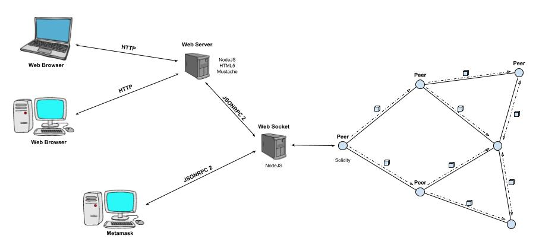

# Iñaki Seco's degree final project
This repository contains the documentation nedeed to install the Certificates Ethereum Blockchain

## Certificates Ethereum Blockchain

### Introduction
The target of this project is to provide a solution to a currently existing problem in the relying tramitation of certificates from one entity to another using the new technologies. To achieve that objective it is necessary a tool in which the user can trust.

Along this document it is possible to understand how blockchain works, to read a summary of its previous approaches, the advantages of using it compared to the systems of nowadays, the potential aplications in the near future, and the reasons to be the perfect implement for flux documents between any kind of user. After that, it will also be developed a complete simulation of a real case of use of a blockchain network based on Ethereum and a smart contract programmed in Solidity and focused on a distributed storage of value-related certificates, discussing the interesting alternatives and the obstacles can be generated and describing the followed steps and used platforms and mechanism to perform this task.

With this target the project shows a novel way of solving countless issues about the social reliance, additionally, it encourages the readers to look up other problems of this nature and researching whether a chain of blocks answers to that.

### Project diagram

The project is divided in three parts. The first one and more important is the *token* which contains the files needed to boot the EVM and run a truffle test to simulate a number of nodes, those nodes will interact with the smart contract, mine it, create certificates... in short, share information stored in blocks. Here we use a tool named Ganache, a explorer for the truffle network, it shows logs from the ethereum network like account's information, transactions, mined blocks, etc.

The second part is web socket which is used to link the user and the EVM using JSONRC 2.0. There many ways to reach the websocket API, that's for what it's supposedly been implemented JSONRPC standard, so that everyone can access to the it, for example using a web server or metamask tool.

The third and last part is a web server that will help the user to send and get information from the blockchain with an easy interface. This server is the mandated for connecting with the web socket using JSONRPC 2.0 by a own designed protocol.