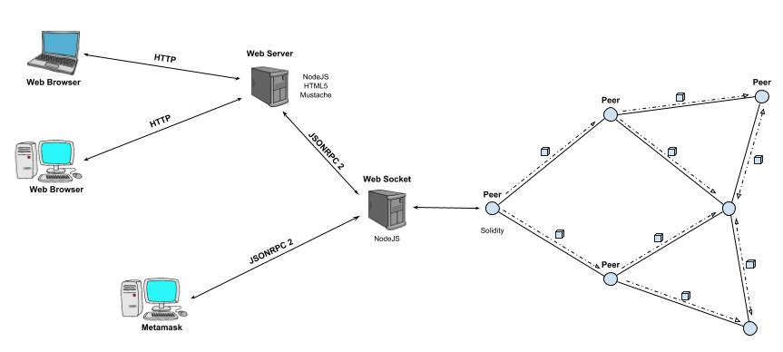

# Iñaki Seco's degree final project
This repository contains the documentation nedeed to install the Certificates Ethereum Blockchain

## Certificates Ethereum Blockchain

### Introduction
The target of this project is to provide a solution to a currently existing problem in the relying tramitation of certificates from one entity to another using the new technologies. To achieve that objective it is necessary a tool in which the user can trust.

Along this document it is possible to understand how Blockchain works, to read a summary of its previous approaches, the advantages of using it compared to the systems of nowadays, the potential aplications in the near future, and the reasons to be the perfect implement for flux documents between any kind of user. After that, it will also be developed a complete simulation of a real case of use of a Blockchain network based on Ethereum and a smart contract programmed in Solidity and focused on a distributed storage of value-related certificates, discussing the interesting alternatives and the obstacles can be generated and describing the followed steps and used platforms and mechanism to perform this task.

With this target the project shows a novel way of solving countless issues about the social reliance, additionally, it encourages the readers to look up other problems of this nature and researching whether a chain of blocks answers to that.

### Network diagram

